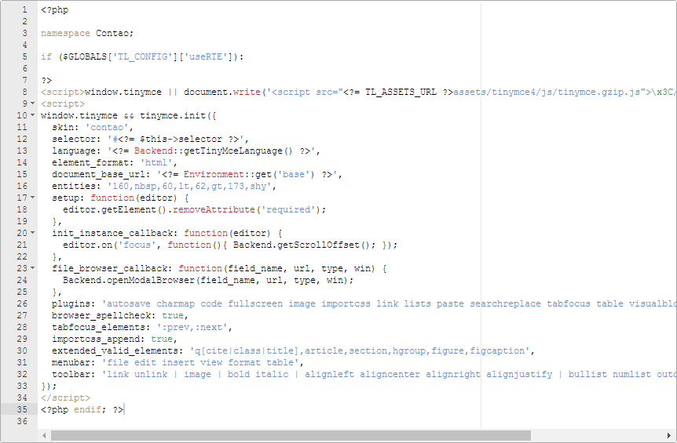
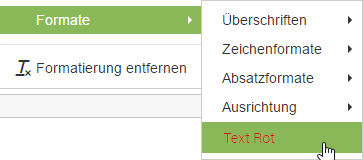
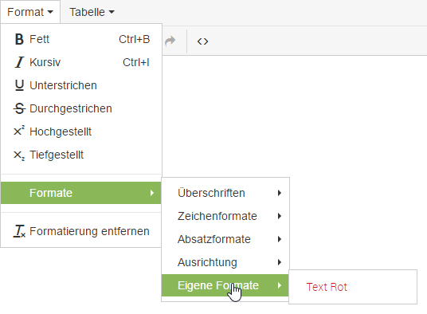

## TinyMCE anpassen

Diese Seite erklärt, wie man die Rich Text Editor-Konfiguration anpasst und
updatesicher speichert. Beachten Sie, dass Contao standardmäßig nicht alle
TinyMCE-Plugins enthält und fehlende Ressourcen gegebenenfalls von der
[TinyMCE-Projektwebseite][1] heruntergeladen und in den Ordner
`assets/tinyMCE/plugins` Ihrer Contao-Installation kopiert werden müssen.



Das obige Bild zeigt die Standardkonfiguration des Editors, die in der Datei
`be_tinyMCE.html5` hinterlegt ist. Um eine eigene Konfiguration zu
erstellen, duplizieren Sie das Template, fügen Sie Ihre Änderungen ein und
speichern Sie die neue Datei als `be_tinyMCE.html5` im Template Hauptverzeichnis.


### Eigene Formatangaben

Um eigene Formate verwenden zu können gibt es zwei Ansätze.
Der erste Ansatz ist, die Styles Inline hinzuzufügen. Hier ein Beispiel:

```js
// Eine Vorgegebene Farbe für Textbereiche definieren:
  style_formats_merge: true,
  style_formats: [
    { title: 'Text Rot', inline: 'span', styles: { 'color': '#d11216' }, classes: 'text-red' },
  ]
```

Wichtig ist hier die Zeile `style_formats_merge: true`.
Diese erlaubt es die eigenen Formate zu hinzuzufügen, ohne die bereits existierenden
zu Überschreiben.



Um die Eigenen Formate etwas auszuräumen, kann ein eigener Bereich angelegt werden:

```js
  style_formats_merge: true,
  style_formats: [
  	{title: 'Eigene Formate', items: [
  		{ title: 'Text Rot', inline: 'span', styles: { 'color': '#d11216'}, classes: 'text-red' },
  	]}
  ]
```



Weitere Informationen zu Anpassungen gibt es in der [TinyMCE Dokumentation][2].


[1]: https://www.tinymce.com/
[2]: https://www.tinymce.com/docs/configure/
